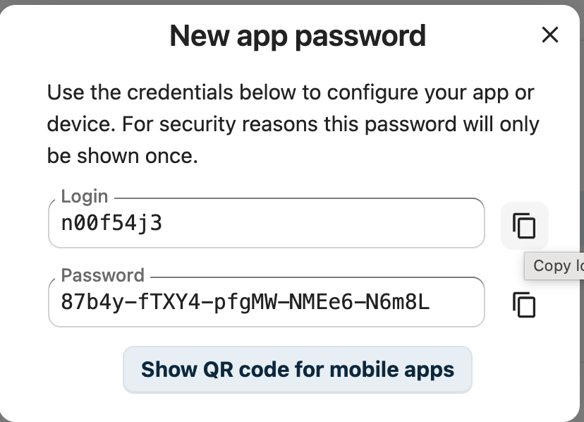

# Database

<figure><figcaption></figcaption></figure>

#### 

#### Create a database backup (dump)

You can use Drush to export your database to a _.sql_ text file.

We're now ready to set up the new instance. The process will be unique to your environment, but you should be able to follow the next steps, at least in general.


