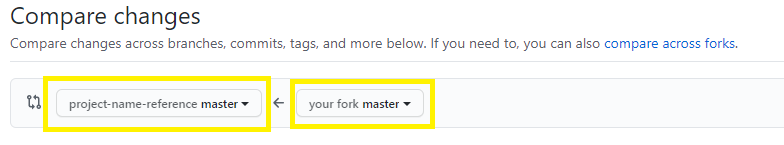
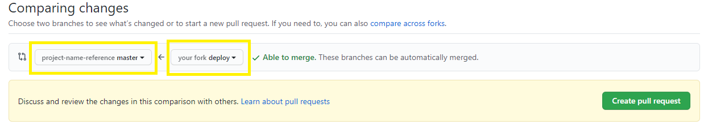

# GIT

## [https://docs.github.com/en/authentication/managing-commit-signature-verification](https://docs.github.com/en/authentication/managing-commit-signature-verification)

## Git Forks and Upstreams: How-to and a cool tip

[https://www.atlassian.com/git/tutorials/git-forks-and-upstreams](https://www.atlassian.com/git/tutorials/git-forks-and-upstreams)

Git usage

**Security**

**Ed25519 Keys**: Many modern systems and guidelines recommend using Ed25519 keys where possible. Ed25519 is a modern elliptic curve algorithm that offers better security, efficiency, and faster performance than older algorithms like RSA. Additionally, Ed25519 keys have a fixed size (256 bits) which simplifies their handling.\
\
Source: _(Sensitivity level: CU) GPT@EC AI generated content – please use with caution._

[**https://www.howtogeek.com/devops/how-to-set-up-https-personal-access-tokens-for-github-authentication/**](https://www.howtogeek.com/devops/how-to-set-up-https-personal-access-tokens-for-github-authentication/)

You can generate a key with this command:

```shell
ssh-keygen -t ed25519 -C "some_identifiable_name_that you_can_share_like_a_username"
```

To check if your SSH key has been added to the `ssh-agent`, you can use the following steps:

1.  **Ensure `ssh-agent` is Running**: First, make sure that the `ssh-agent` is running. You can start it by running:

    ```bash
    eval "$(ssh-agent -s)"
    ```

    This command initializes the `ssh-agent` and sets the environment variables for your shell session.
2.  **List the SSH Keys Managed by `ssh-agent`**: To see which keys are currently added to the `ssh-agent`, use the following command:

    ```bash
    ssh-add -l
    ```

    This will list the fingerprints of the keys that are currently added to the `ssh-agent`. If your key is listed there, then it has been added successfully.
3.  **If No Keys Are Listed**: If you don't see any keys listed, or if your specific key is not listed, you may need to add your key to the `ssh-agent` by running:

    ```bash
    ssh-add ~/.ssh/id_ed25519
    ```

By following these steps, you can verify whether your SSH key is added to the `ssh-agent` and take action if it's not listed.

Source: Adapted from (Sensitivity level: CU) GPT@EC AI generated content – please use with caution.

### [SSH commit signature verification](https://docs.github.com/en/authentication/managing-commit-signature-verification/about-commit-signature-verification#ssh-commit-signature-verification) <a href="#ssh-commit-signature-verification" id="ssh-commit-signature-verification"></a>

You can use SSH to sign commits with an SSH key that you generate yourself. For more information, see the [Git reference documentation](https://git-scm.com/docs/git-config#Documentation/git-config.txt-usersigningKey) for `user.Signingkey`. If you already use an SSH key to authenticate with GitHub, you can also upload that same key again for use as a signing key. There's no limit on the number of signing keys you can add to your account.

GitHub uses [ssh\_data](https://github.com/github/ssh_data), an open source Ruby library, to confirm that your locally signed commits and tags are cryptographically verifiable against a public key you have added to your account on GitHub.com.

Note

SSH signature verification is available in Git 2.34 or later. To update your version of Git, see the [Git](https://git-scm.com/downloads) website.

To sign commits using SSH and have those commits verified on GitHub, follow these steps:

1. [Check for existing SSH keys](https://docs.github.com/en/authentication/connecting-to-github-with-ssh/checking-for-existing-ssh-keys)
2. [Generate a new SSH key](https://docs.github.com/en/authentication/connecting-to-github-with-ssh/generating-a-new-ssh-key-and-adding-it-to-the-ssh-agent)
3. [Add a SSH signing key to your GitHub account](https://docs.github.com/en/authentication/connecting-to-github-with-ssh/adding-a-new-ssh-key-to-your-github-account)
4. [Tell Git about your signing key](https://docs.github.com/en/authentication/managing-commit-signature-verification/telling-git-about-your-signing-key)
5. [Sign commits](https://docs.github.com/en/authentication/managing-commit-signature-verification/signing-commits)
6. [Sign tags](https://docs.github.com/en/authentication/managing-commit-signature-verification/signing-tags)

Source:\
[Creating/Converting/Move SSH keys to the right place](https://webgate.ec.europa.eu/fpfis/wikis/pages/viewpage.action?pageId=297601060#id-6.C9,SSH\&PhpStorm-Configurationfileforscripts)\
\


**GIT aliases**\
[https://alblue.bandlem.com/2011/04/git-tip-of-week-aliases.html](https://alblue.bandlem.com/2011/04/git-tip-of-week-aliases.html)\
\
**Saving locally**\
\*\*\*\*`git stash` temporarily shelves (or _stashes_) changes you've made to your working copy so you can work on something else, and then come back and re-apply them later on. Stashing is handy if you need to quickly switch context and work on something else, but you're mid-way through a code change and aren't quite ready to commit.\
[https://www.atlassian.com/git/tutorials/saving-changes/git-stash](https://www.atlassian.com/git/tutorials/saving-changes/git-stash)


## GIT remote

Clone your fork or set your origin to be your fork

<pre class="language-bash"><code class="lang-bash"><strong>git remote set-url origin &#x3C;NEW_GIT_URL_HERE>
</strong></code></pre>

Create upstream to the reference branch

```shell
git remote add upstream https://github.com/ORIGINAL-OWNER/ORIGINAL-REPOSITORY.git
```


It is good practice to keep the feature branch always up to date with [trunk](https://www.atlassian.com/continuous-delivery/continuous-integration/trunk-based-development).\
If your branch is recent, the first option is to use rebase.

```
git checkout feature/my-feature
git rebase -i master
```

Sources: [https://www.atlassian.com/continuous-delivery/continuous-integration/trunk-based-development](https://www.atlassian.com/continuous-delivery/continuous-integration/trunk-based-development)

### Deployment into ACC

#### There are two options:

* **Traditional approach**
* **Using the auto-merge functionality**

#### Traditional approach

If we don't want to use the auto-merge we can proceed as the usual way, so **from our fork 's \<branch\_name> against reference's master branch.**



**PS:** Once the pipeline have green lines, we need to **contact QA Team and request a code review** before lead ACC. If we pass this code review QA directly merge our PR into master and a new drone execution will be triggered to deploy in ACC.

#### Auto-merge approach

We can use this functionality naming our fork's branch **"deploy",** so in order to trigger a new drone we need to open a **new PR from our fork's deploy branch against reference's master branch** as following:



Keep in mind that you can go straight to ACC but a QA review will be needed before lead PROD (unless you are hosted in a dedicated server, then deploy into PROD is under your own risk).\
Source: [https://webgate.ec.europa.eu/fpfis/wikis/x/4YZMQ](https://webgate.ec.europa.eu/fpfis/wikis/x/4YZMQ)

This command below will, afterwards, remove all of the items from the Git index (not from the working directory or local repository), and then will update the Git index, while respecting Git ignores. _PS. Index = Cache_

<mark style="background-color:orange;">git rm -r --cached . && git add . && git commit -am "EJPREV-00: Remove ignored files."</mark>


### git reflog

[<mark style="background-color:orange;">https://www.atlassian.com/git/tutorials/rewriting-history/git-reflog</mark>](https://www.atlassian.com/git/tutorials/rewriting-history/git-reflog)

